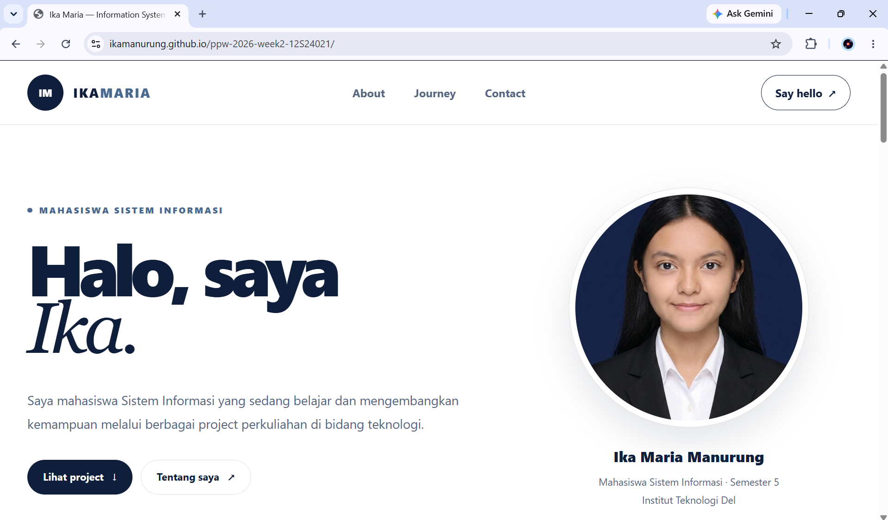
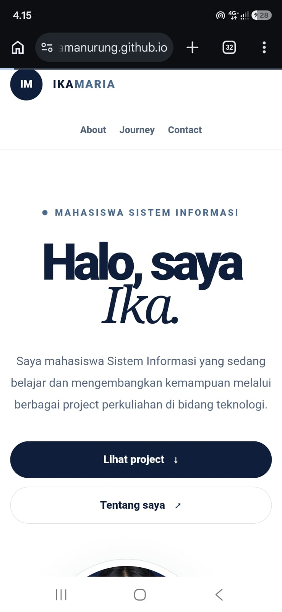

# Portfolio Ika Maria

Halaman portofolio tunggal untuk tugas mandiri **Minggu 02: HTML5, CSS3, dan Perancangan Antarmuka Web Modern** pada matakuliah Pemrograman dan Pengujian Aplikasi Web (12S3101), Institut Teknologi Del.

- **Nama:** Ika Maria Manurung
- **NIM:** 12S24021
- **Program studi:** S1 Sistem Informasi, Institut Teknologi Del
- **Demo live:** https://USERNAME.github.io/ppw-2026-week2-NIM/

## Tampilan





## Isi halaman

| Bagian | Keterangan |
| --- | --- |
| Home | Perkenalan singkat dan foto profil |
| About | Profil singkat dan proses belajar (`<ol>`) |
| Academic Journey | Tabel semantik project: CendraMatak, Laundry Del, Ma-U, dan Imunify |
| Contact | Formulir kontak dengan 3 `fieldset` dan 9 jenis kontrol input |

## Fitur teknis

- **HTML5 semantik:** `header`, `nav`, `main`, `section`, `article`, `aside`, `footer`.
- **Tabel lengkap:** `caption`, `thead`, `tbody`, `tfoot`, dan atribut `scope`.
- **List:** `<ul>` untuk navigasi dan pilihan, `<ol>` untuk proses belajar.
- **Formulir aksesibel:** `fieldset` dan `legend`, `label for` pada setiap input, validasi native (`required`, `pattern`, `minlength`, `min`, `max`), dan `aria-describedby`.
- **CSS eksternal** dengan reset `box-sizing: border-box`, palet navy dan putih, tata letak CSS Grid dan Flexbox, `border-radius`, `box-shadow`, serta transisi hover.
- **Responsif** untuk desktop, tablet, dan ponsel melalui media query.
- **Aksesibilitas:** tautan lewati konten, fokus keyboard terlihat, dan dukungan `prefers-reduced-motion`.

## Struktur berkas

```
ppw-2026-week2-NIM/
├── index.html
├── style.css
├── README.md
├── images/
│   └── foto-ika.png
└── screenshots/
    ├── desktop.png
    └── mobile.png
```

## Menjalankan secara lokal

1. Clone repositori ini:
   ```bash
   git clone https://github.com/USERNAME/ppw-2026-week2-NIM.git
   ```
2. Buka `index.html` di peramban, atau gunakan ekstensi **Live Server** di VS Code.

## Publikasi

Dipublikasikan dengan GitHub Pages dari branch `main` (folder root).